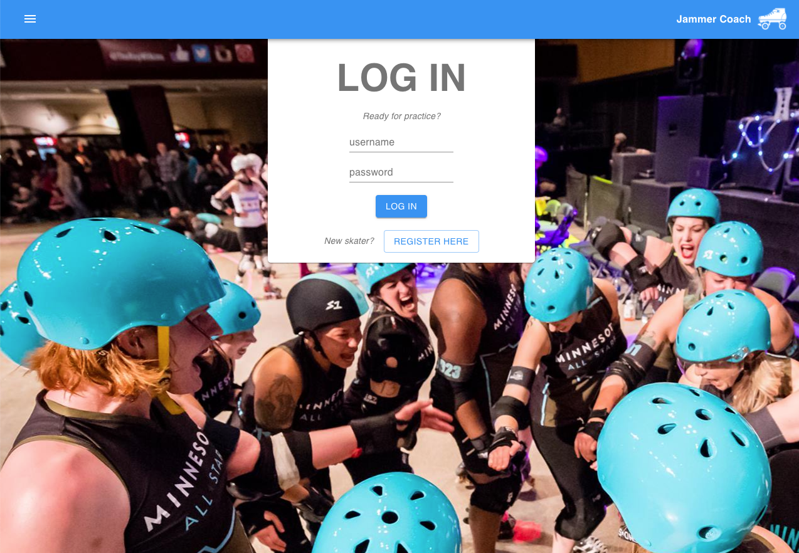
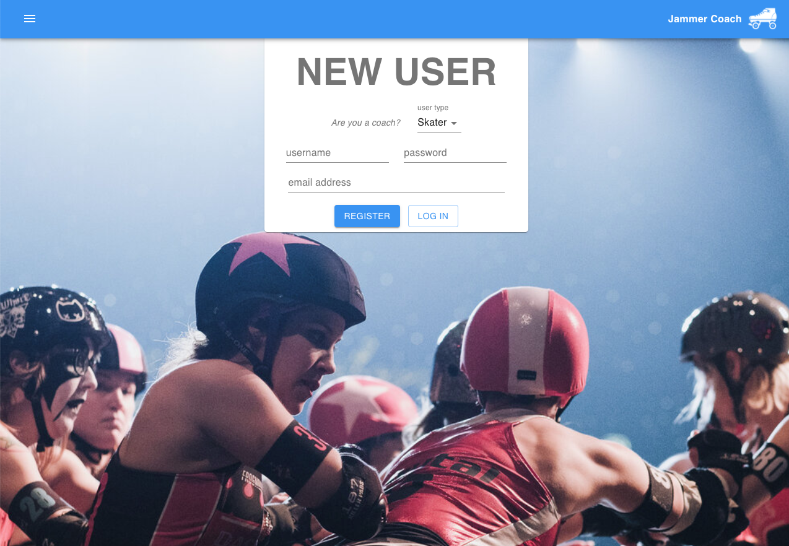
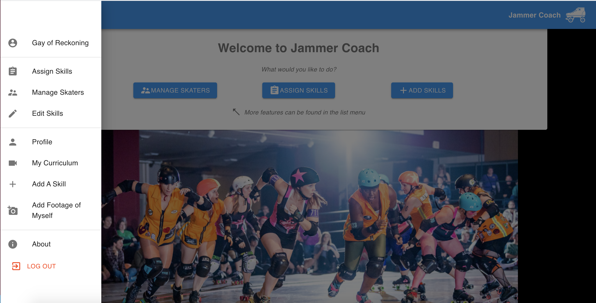
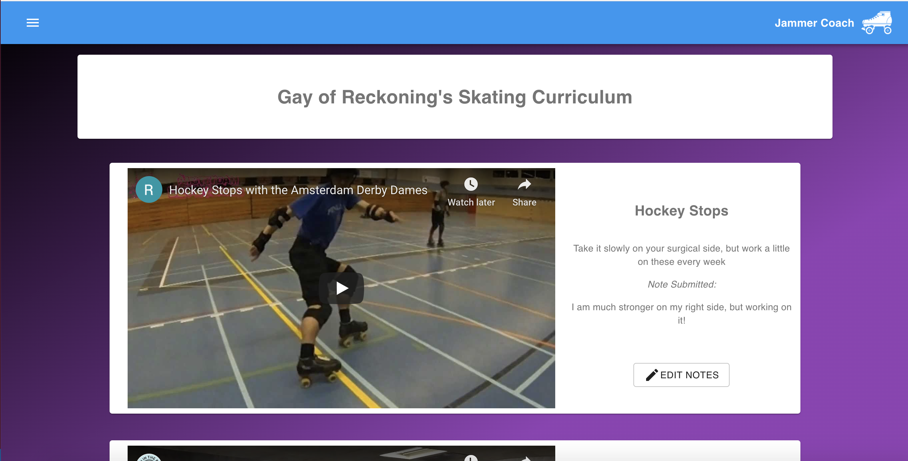
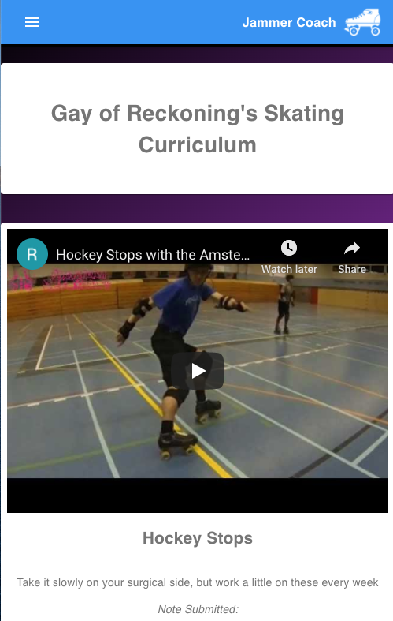
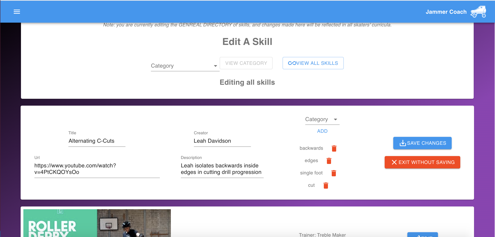
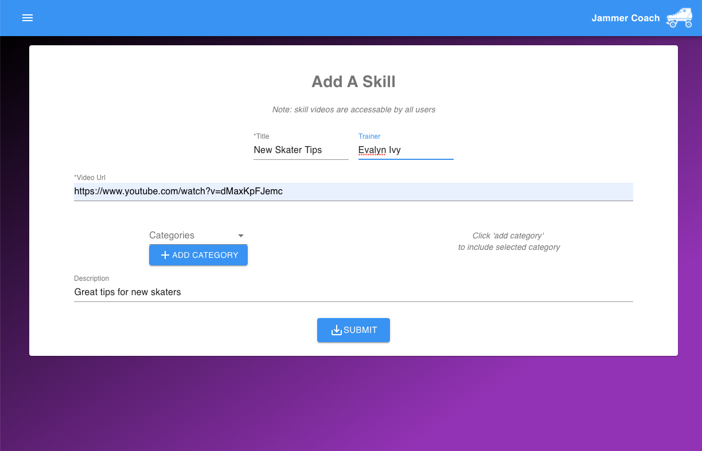
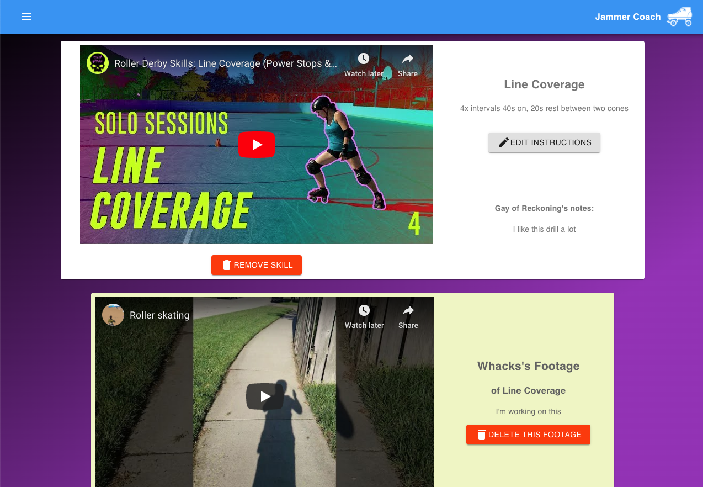

# Jammer Coach

Jammer Coach is a training app for roller derby skaters and coaches to be used either in supplement to in-person training, or in its place when physically meeting up to skate and train together is impossible.  A coach can view, and add to a list of short videos showing skating skills for a skater to practice.  The coach can then assign each skater an assortment of these skills each week, with notes outlining the frequency and form for each movement.  The skater in training can then view and leave comments about  each of the drill videos. Skaters can also add to the stored list of videos in a collaborative effort to build derby knowledge


*Duration: Two Week Sprint*

## Screen Shots

**Log in View**

**Registration Page**

**Landing View with Open Menu**

**Curriculum View on Desktop**

**Curriculum View on Mobile**

**Coach View - Edit Skills**

**Add Skill View**

**Coach View - Manage Skaters with Footage**


## Usage

1. Register a new account - select COACH user type for access to full functionality
2. Click the HAMBURGER MENU icon in the upper left hand corner to open the NAVIGATION MENU
3. Click ADD A SKILL and input data to reference hosted video skills (YouTube, Vimeo, etc.)
4. EDIT SKILLS allows you to edit skill information or categories or delete skill videos
5. ASSIGN SKILLS allows you to assign skills to another user's curriculum
6. In MY CURRICULUM, A skater can view their assigned skills and leave notes for their coach
7. A skater can ADD FOOTAGE of themself completing a skill. 
8. This footage is then visible to a coach in the MANAGE SKATER view, along with notes and curriculum skills.
9. A coach or skater can view and update their email, goals, and bio in their PROFILE
10. All views of this app are flexible and functional on a mobile device.

### Prerequisites

Before you get started, make sure you have the following software installed on your computer:

- [Node.js](https://nodejs.org/en/)
- [PostrgeSQL](https://www.postgresql.org/)
- [Nodemon](https://nodemon.io/)


### Installing

* Create a database named `prime_app`
* The queries in the `tables.sql` file are set up to create all the necessary tables and populate the needed data to allow the application to run correctly. The project is built on [Postgres](https://www.postgresql.org/download/), so you will need to make sure to have that installed. We recommend using Postico to run those queries as that was used to create the queries
* Run `npm install`
* Create a `.env` file at the root of the project and paste this line into the file:
    ```
    SERVER_SESSION_SECRET=superDuperSecret
    ```
    While you're in your new `.env` file, take the time to replace `superDuperSecret` with some long random string like `25POUbVtx6RKVNWszd9ERB9Bb6` to keep your application secure. Here's a site that can help you: [https://passwordsgenerator.net/](https://passwordsgenerator.net/). If you don't do this step, create a secret with less than eight characters, or leave it as `superDuperSecret`, you will get a warning.
* Start postgres if not running already by using `brew services start postgresql`
* Run `npm run server`
* Run `npm run client`
* The `npm run client` command will open up a new browser tab for you!


## Deployment:

Before pushing to Heroku, run `npm run build` in terminal. This will create a build folder that contains the code Heroku will be pointed at. You can test this build by typing `npm start`. Keep in mind that `npm start` will let you preview the production build but will **not** auto update.

## Built With

* [React-Player](https://www.npmjs.com/package/react-player) - The video framework used
 -  React.js
 -  React-redux
 -  Sagas
 -  node.js
 -  express.js
 -  Material-UI
 -  PostgreSql

## Authors

* **Ace Fox** - *Initial work* - [Gay of Reckoning](https://github.com/GayofReckoning)

## Acknowledgments

* Thanks to Prime Digital Academy, especially instructors Dev Jana and Mary Mosman for providing me with the knowlege needed to make this app a reality
* Thanks to the Paxos Cohort, especially Carl Wilcoxon and Audrey Woltors for all of the help and support
* Photography of Minnesota Roller Derby athletes by Ron Wilbur and Workhorse Photography - Thank you for you work
* Thank you to the strong community of Roller Derby athletes and trainers committed to Open Source resources
* Bird Up!


